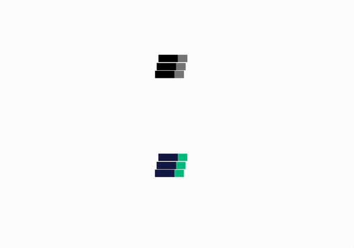

# React Cube Loading Spinner

Super cool configurable cube loading spinner for react. There are 4 configurable options. With TypeScript support.

| props              | purpose                                                                                 |
| ------------------ | --------------------------------------------------------------------------------------- |
| mainColor          | Main color of the cube. It takes any CSS color values (color name, hex, rgb).           |
| secondaryColor     | Secondary color of the cube                                                             |
| spinnerInnerHeight | Height of the inner spinner in pixel. The dimension will be spinnerInnerHeight times 3. |
| spinnerSpeed       | Speed of the spinner rotation in second (e.g. 1.5).                                     |

## Usage

Import the module.

```tsx
import { CubeLoadingSpinner } from "@mdhnpm/cube-loading-spinner";
```

We can configure the spinner. Note that when `spinnerInnerHeight` is 9, the dimension of the cube will be `27 x 27 x 27px`.

```tsx
<CubeLoadingSpinner
  mainColor="black"
  secondaryColor="gray"
  spinnerInnerHeight={9}
  spinnerSpeed={1.5}
/>
```

The props are optional. If you don't pass any prop, you can get a default spinner.

```tsx
<CubeLoadingSpinner />
```

And this is what it looks like...



Enjoy 🤟💀🤟
